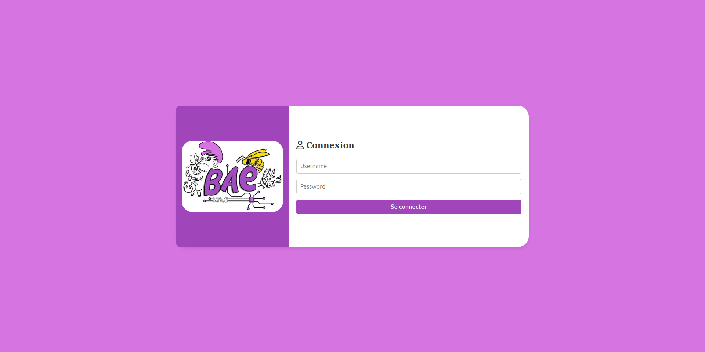
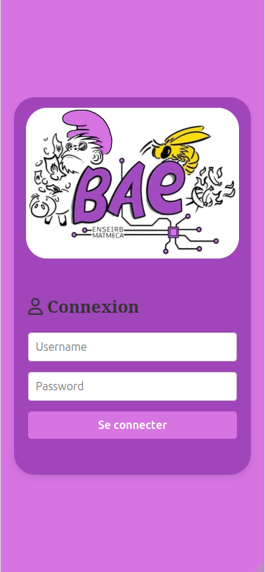
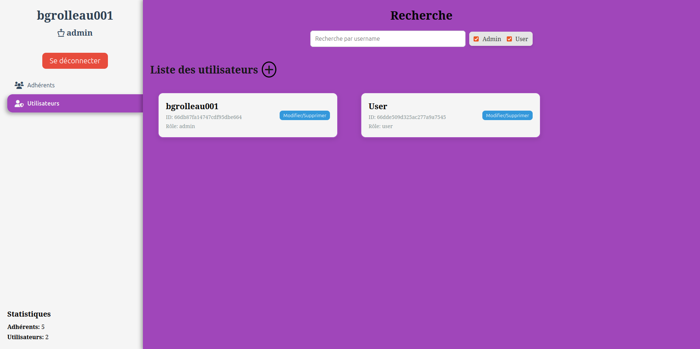
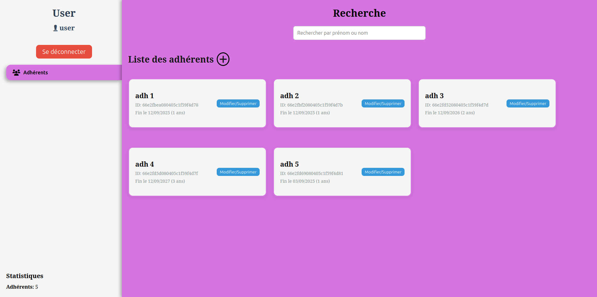

# BAE App - Membership Management for Associations

BAE App is an application designed to simplify membership management for a French association. This project is a **side project** developed by a first-year engineering student specializing in networks and computer science. The application allows for efficient and centralized management of users and members through a user-friendly interface and a secure backend. This project have also been a occasion to discover and make a first NestJS project.

## How the Application Works

The BAE App consists of two main parts:
1. **Frontend**: A user interface built with **React** and **Vite**, allowing administrators and users to manage members and view information.
2. **Backend**: A RESTful API developed with **NestJS**, handling user and member requests, as well as authentication via a secure **JWT** system. The backend connects to a **MongoDB** database to store and manage data.

### Key Features:
- **User Management**: Add, modify, delete, and view users.
- **Member Management**: Add, modify, delete, and view association members.
- **Secure Authentication**: Uses **JWT** to secure access and authenticate users.
- **Intuitive Interface**: User and member management is centralized and made easy through clear and simple interfaces.

## Setting Up the Application

The application consists of three parts to install and configure: the frontend, the backend, and the MongoDB database.

### 1. Frontend Installation

The frontend is built with **React** and **Vite**. Here's how to configure it:

1. **Install dependencies**:
   ```bash
   npm i
   ```

2. **Configure environment variables**:
   Create a `.env` file in the `frontend/` directory with the following variable:
   ```env
   VITE_API_URL=http://localhost:3002/api
   ```

3. **Start the application**:
   In development mode with hot-reload:
   ```bash
   npm run dev
   ```

   To build for production:
   ```bash
   npm run build
   ```

### 2. Backend Installation

The backend uses **NestJS**, a modern and efficient Node.js framework. To configure the backend:

1. **Install dependencies**:
   ```bash
   npm i
   ```

2. **Configure environment variables**:
   Create a `.env.yaml` file in the `backend/` directory with the following information:
   ```yml
   jwt: 
     secret: <long-string> # JWT Secret
   mongoose:
     port: 27017
     dbName: baeAppDB
     user: <db-user>
     password: <db-password>
   ```

3. **Start the backend**:
   In development mode with hot-reload:
   ```bash
   npm run start:dev
   ```

   In production mode:
   ```bash
   npm run start
   ```

### 3. MongoDB Database Setup

The project uses **MongoDB** for managing users and members. MongoDB is set up using Docker.

1. **Configure environment variables**:
   Create a `.env` file in the `db/` directory with the following information:
   ```env
   MONGO_PORT=27017
   MONGO_INITDB_ROOT_USERNAME=root
   MONGO_INITDB_ROOT_PASSWORD=root_password
   MONGO_DB_NAME=baeAppDB
   MONGO_USER=dbUser
   MONGO_USER_PASSWORD=dbUserPassword
   ```

2. **Initialize the database**:
   Use the `init-mongo.sh` script to start MongoDB and initialize the collections:
   ```bash
   ./init-mongo.sh
   ```

3. **Start MongoDB**:
   After initialization, MongoDB can be started with Docker Compose:
   ```bash
   docker-compose up
   ```

## Screenshots
### 1. Login page


### 2. Admin dashboard for membres

### 3. Admin dashboard for users

### 4. User dashboard


## Technologies Used

- **Frontend**: 
  - [React](https://reactjs.org/) - A JavaScript library for building user interfaces.
  - [Vite](https://vitejs.dev/) - A fast build tool for development.
  - [TypeScript](https://www.typescriptlang.org/) - A typed superset of JavaScript.
  
- **Backend**: 
  - [NestJS](https://nestjs.com/) - A progressive Node.js framework used to build server-side applications.
  - **NestJS** is licensed under the MIT License. You can view the [NestJS license](https://github.com/nestjs/nest/blob/master/LICENSE) for more details.
  - **JWT** - Used for secure authentication token management.

- **Database**:
  - **MongoDB** - A NoSQL database for storing users and members.
  - [Mongoose](https://mongoosejs.com/) - An ODM used with MongoDB.

## Legal Mentions

BAE App is licensed under the **MIT License**. You can view the [MIT License](./LICENSE) for more details.
